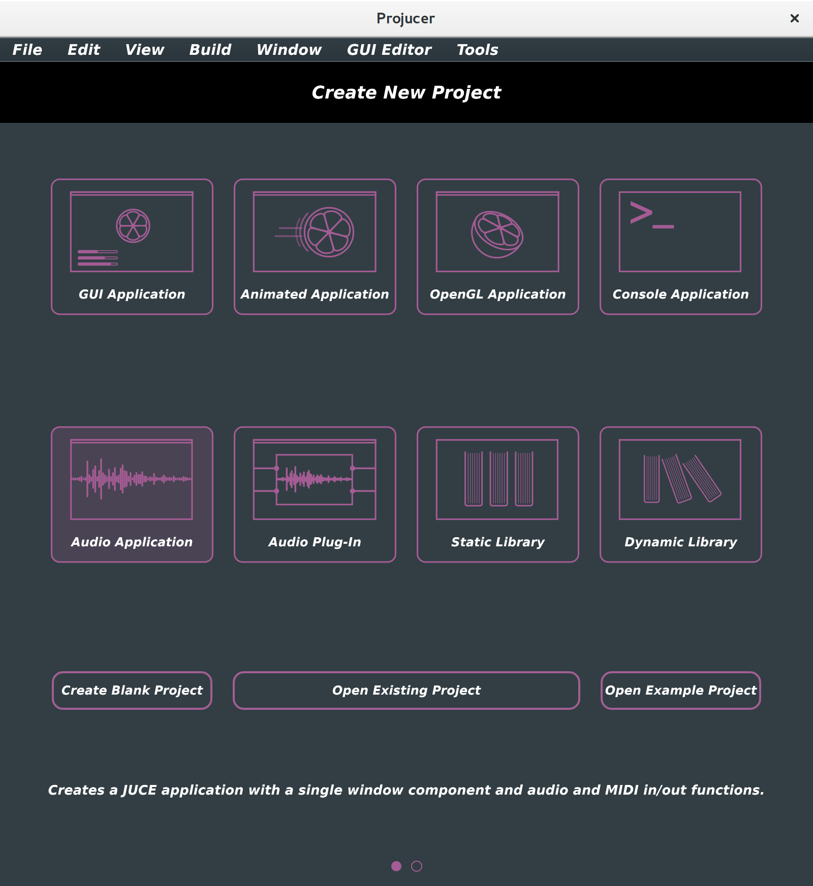

# Download the JUCE library
```bash
cd
git clone https://github.com/WeAreROLI/JUCE
```

# Dependencies (Ubuntu 16)
See the [JUCE forum](https://forum.juce.com/t/list-of-juce-dependencies-under-linux/15121)
```
sudo apt-get -y install libasound2-dev
sudo apt-get -y install libfreetype6-dev
sudo apt-get -y install libxinerama-dev
sudo apt-get -y install libcurl4-gnutls-dev
sudo apt-get -y install libx11-dev
sudo apt-get -y install libxrandr-dev
sudo apt-get -y install libxcursor-dev
sudo apt-get -y install libgtk-3-dev
sudo apt-get -y install webkit2gtk-4.0
```

# Demo
Compile
```bash
cd JUCE/examples/Demo/Builds/LinuxMakefile
make -j 4
```
Run
```bash
./build/JuceDemo
```

# Compile the project manager
Compile
```bash
cd ~/JUCE/extras/Projucer/Builds/LinuxMakefile/
make -j 4
```

Run
```bash
./build/Projucer 
JUCE v5.1.1

**********************************************************
Projucer 5.1.1  ---  Build date: Aug 22 2017
Log started: 22 Aug 2017 5:43:36pm

Linux
CPU: 861MHz  Cores: 4  7882MB
```

# Compile all the Linux demos
```bash
cd ~/JUCE/examples
for dir in $(find . -name LinuxMakefile); do pushd $dir; make -j 4; popd; done
```

# Create a new Audio Application


# Building on the command line
```bash
cd <projname>/Builds/LinuxMakefile
make -j 4
```
